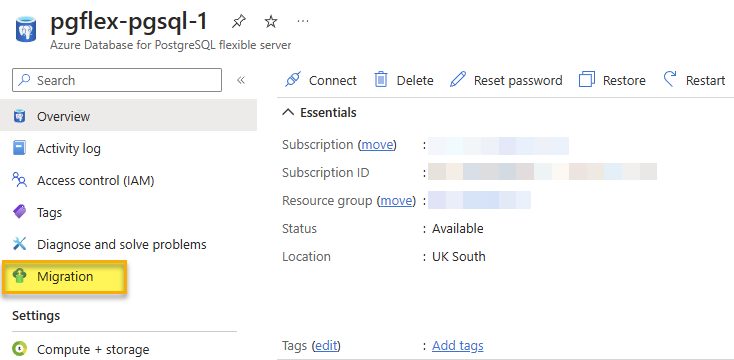

---
lab:
  title: Migração de banco de dados PostgreSQL offline
  module: Migrate to Azure Database for PostgreSQL Flexible Server
---

# Migração de banco de dados PostgreSQL offline

Neste exercício, você criará um servidor flexível do Banco de Dados do Azure para PostgreSQL e executará uma migração de banco de dados offline de um servidor PostgreSQL local ou de um servidor do Banco de Dados do Azure para PostgreSQL usando o recurso Migração no servidor flexível do Banco de Dados do Azure para PostgreSQL.

## Antes de começar

Você precisa ter uma assinatura própria do Azure para concluir este exercício. Se você não tiver uma assinatura do Azure, crie uma [conta de avaliação gratuita do Azure](https://azure.microsoft.com/free).

### Edite o arquivo pg_hba.conf para permitir a conectividade do Azure (ignore se não estiver migrando de um servidor PostgreSQL externo)

> [!NOTE]
> Este laboratório cria dois Banco de Dados do Azure para PostgreSQL a serem usados como origem e destino para a migração. No entanto, se você estiver usando seu próprio ambiente, para concluir este exercício, precisará de acesso a um servidor PostgreSQL existente com um banco de dados, permissões apropriadas e acesso à rede.
> 
> Se você usar seu próprio ambiente, este exercício exigirá que o servidor usado como fonte para a migração esteja acessível ao servidor flexível do Banco de Dados do Azure para PostgreSQL para que ele possa se conectar e migrar bancos de dados. Isso exigirá que o servidor de origem seja acessível por meio de um endereço IP e porta públicos. Uma lista de endereços IP da região do Azure pode ser baixada de [Intervalos de IP e marcas de serviço do Azure – Nuvem pública](https://www.microsoft.com/en-gb/download/details.aspx?id=56519) para ajudar a minimizar os intervalos permitidos de endereços IP em suas regras de firewall com base na região do Azure usada. Abra o firewall dos servidores para permitir que o recurso de Migração de servidor flexível do Banco de Dados do Azure para PostgreSQL acesse a origem do servidor PostgreSQL que, por padrão, é a porta TCP **5432**.
>
> Ao usar um dispositivo de firewall na frente de seus bancos de dados de origem, talvez seja necessário adicionar regras de firewall para permitir que o serviço de Migração de servidor flexível do Banco de Dados do Azure para PostgreSQL acesse os bancos de dados de origem para migração.
>
> A versão máxima suportada do PostgreSQL para migração é a versão 16.

O servidor PostgreSQL de origem precisará ter o arquivo pg_hba.conf atualizado para garantir que a instância permita a conectividade do servidor flexível do Banco de Dados do Azure para PostgreSQL.

1. Você adicionará entradas ao pg_hba.conf para permitir conexões dos intervalos de IP do Azure. As entradas no pg_hba.conf determinam quais hosts podem se conectar, quais bancos de dados, quais usuários e quais métodos de autenticação podem ser usados.
1. Por exemplo, se os serviços do Azure estiverem dentro do intervalo de IP 104.45.0.0/16. Para permitir que todos os usuários se conectem a todos os bancos de dados desse intervalo usando a autenticação por senha, você adicionaria:

``` bash
host    all    all    104.45.0.0/16    md5
```

1. Ao permitir conexões pela Internet, inclusive do Azure, verifique se você tem mecanismos de autenticação fortes em vigor

- Use uma senha forte.
- Restrinja o acesso ao menor número possível de endereços IP.
- Use uma VPN ou VNet: se possível, configure uma VPN (Rede Virtual Privada) ou uma VNet (Rede Virtual) do Azure para fornecer um túnel seguro entre o Azure e o servidor PostgreSQL.

1. Depois de salvar as alterações no pg_hba.conf, você deve recarregar a configuração do PostgreSQL para que as alterações entrem em vigor usando um comando SQL em uma sessão psql:

```sql
SELECT pg_reload_conf();
```

1. Teste a conexão do Azure com o servidor PostgreSQL local para garantir que a configuração funciona conforme o esperado. Você pode fazer isso em uma VM do Azure ou em um serviço que dá suporte a conexões de banco de dados de saída.

### Implantar recursos na assinatura do Azure

Esta etapa orienta você no uso de comandos da CLI do Azure do Azure Cloud Shell para criar um grupo de recursos e executar um script Bicep para implantar os serviços do Azure necessários para concluir este exercício em sua assinatura do Azure.

1. Abra um navegador da Web e acesse o [portal do Azure](https://portal.azure.com/).

1. SElecione o ícone do **Cloud Shell** na barra de ferramentas do portal do Azure para abrir um novo painel do [Cloud Shell](https://learn.microsoft.com/azure/cloud-shell/overview) na parte inferior da janela do navegador.

    

    Se solicitado, selecione as opções necessárias para abrir um shell do *Bash*. Se você já usou um console do *PowerShell*, alterne-o para um shell do *Bash*.

1. No prompt do Cloud Shell, insira o seguinte para clonar o repositório GitHub que contém os recursos do exercício:

    ```bash
    git clone https://github.com/MicrosoftLearning/mslearn-postgresql.git
    ```

1. Em seguida, você executará três comandos para definir variáveis para reduzir a digitação redundante ao usar comandos da CLI do Azure para criar recursos do Azure. As variáveis representam o nome a ser atribuído ao seu grupo de recursos (`RG_NAME`), a região do Azure (`REGION`) na qual os recursos serão implantados e uma senha gerada aleatoriamente para o logon de administrador do PostgreSQL (`ADMIN_PASSWORD`).

    No primeiro comando, a região atribuída à variável correspondente é `eastus`, mas você também pode substituí-la por um local de sua preferência.

    ```bash
    REGION=eastus
    ```

    O comando a seguir atribui o nome a ser usado para o grupo de recursos que abrigará todos os recursos usados neste exercício. O nome do grupo de recursos atribuído à variável correspondente é `rg-learn-work-with-postgresql-$REGION`, onde `$REGION` é o local especificado acima. No entanto, você pode alterá-lo para qualquer outro nome de grupo de recursos que atenda às suas preferências.

    ```bash
    RG_NAME=rg-learn-work-with-postgresql-$REGION
    ```

    O comando final gera aleatoriamente uma senha para o login de administrador do PostgreSQL. Certifique-se de copiá-lo para um local seguro para usar mais tarde para se conectar ao seu servidor flexível do PostgreSQL.

    ```bash
    a=()
    for i in {a..z} {A..Z} {0..9}; 
       do
       a[$RANDOM]=$i
    done
    ADMIN_PASSWORD=$(IFS=; echo "${a[*]::18}")
    echo "Your randomly generated PostgreSQL admin user's password is:"
    echo $ADMIN_PASSWORD
    ```

1. Se você tiver acesso a mais de uma assinatura do Azure e sua assinatura padrão não for aquela na qual você deseja criar o grupo de recursos e outros recursos para este exercício, execute este comando para definir a assinatura apropriada, substituindo o token `<subscriptionName|subscriptionId>` pelo nome ou ID da assinatura que você deseja usar:

    ```azurecli
    az account set --subscription <subscriptionName|subscriptionId>
    ```

1. Execute o seguinte comando da CLI do Azure para criar um grupo de recursos:

    ```azurecli
    az group create --name $RG_NAME --location $REGION
    ```

1. Por fim, use a CLI do Azure para executar um script de implantação do Bicep para provisionar recursos do Azure em seu grupo de recursos:

    ```azurecli
    az deployment group create --resource-group $RG_NAME --template-file "mslearn-postgresql/Allfiles/Labs/Shared/deploy-postgresql-server-migration.bicep" --parameters adminLogin=pgAdmin adminLoginPassword=$ADMIN_PASSWORD databaseName=adventureworks
    ```

    O script de implantação do Bicep provisiona os serviços do Azure necessários para concluir este exercício em seu grupo de recursos. Os recursos implantados são dois servidores flexíveis do Banco de Dados do Azure para PostgreSQL. Um servidor de origem e um servidor de destino para a migração.

    A implantação normalmente leva vários minutos para ser concluída (5-10+ minutos). Você pode monitorá-lo no Cloud Shell ou navegar até a página **Implantações** do grupo de recursos criado acima e observar o progresso da implantação lá.

1. Feche o painel do Cloud Shell quando a implantação do recurso for concluída.

1. No portal do Azure, examine os nomes dos dois novos servidores do Banco de Dados do Azure para PostgreSQL. Observe que, quando você lista os bancos de dados do servidor de origem, ele inclui o banco de dados **adventureworks**, mas o de destino não.

1. Na seção **Rede** de *ambos* os servidores,
    1. Selecione **+ Adicionar endereço IP atual (xxx.xxx.xxx)** e **Salvar**.
    1. Marque a caixa de seleção ao lado de **Permitir acesso público por meio de qualquer serviço do Azure dentro do Azure para este servidor**.
    1. Marque a caixa de seleção**Permitir acesso público a esse recurso por meio da Internet usando um endereço IP público**.

> [!NOTE]
> Em um ambiente de produção, você precisaria selecionar apenas as opções, redes e IPs que deseja que acessem seus servidores do Banco de Dados do Azure para PostgreSQL. 

> [!NOTE]
> Conforme mencionado anteriormente, esse script Bicep criará dois servidores do Banco de Dados do Azure para PostgreSQL, um de origem e um de destino.  ***Se você estiver usando um servidor PostgreSQL local em seu ambiente como o servidor de origem deste laboratório, substitua as informações de conexão do servidor de origem em todas as instruções a seguir pelas informações de conexão do servidor local em seu ambiente***.  Certifique-se de habilitar as regras de firewall necessárias em seu ambiente e no Azure.
    
### Solucionar erros de implantação

Você pode encontrar alguns erros ao executar o script de implantação do Bicep. As mensagens mais comuns e as etapas para resolvê-las são:

- Se você executou anteriormente o script de implantação do Bicep para este roteiro de aprendizagem e, posteriormente, excluiu os recursos, poderá receber uma mensagem de erro como a seguinte se estiver tentando executar novamente o script dentro de 48 horas após a exclusão dos recursos:

    ```bash
    {"code": "InvalidTemplateDeployment", "message": "The template deployment 'deploy' is not valid according to the validation procedure. The tracking id is '4e87a33d-a0ac-4aec-88d8-177b04c1d752'. See inner errors for details."}
    
    Inner Errors:
    {"code": "FlagMustBeSetForRestore", "message": "An existing resource with ID '/subscriptions/{subscriptionId}/resourceGroups/rg-learn-postgresql-ai-eastus/providers/Microsoft.CognitiveServices/accounts/{accountName}' has been soft-deleted. To restore the resource, you must specify 'restore' to be 'true' in the property. If you don't want to restore existing resource, please purge it first."}
    ```

    Se você receber essa mensagem, modifique o comando `azure deployment group create` acima para definir o parâmetro `restore` igual a `true` e execute-o novamente.

- Se a região selecionada estiver impedida de provisionar recursos específicos, você deverá definir a variável `REGION` como um local diferente e executar novamente os comandos para criar o grupo de recursos e executar o script de implantação do Bicep.

    ```bash
    {"status":"Failed","error":{"code":"DeploymentFailed","target":"/subscriptions/{subscriptionId}/resourceGroups/{resourceGrouName}/providers/Microsoft.Resources/deployments/{deploymentName}","message":"At least one resource deployment operation failed. Please list deployment operations for details. Please see https://aka.ms/arm-deployment-operations for usage details.","details":[{"code":"ResourceDeploymentFailure","target":"/subscriptions/{subscriptionId}/resourceGroups/{resourceGrouName}/providers/Microsoft.DBforPostgreSQL/flexibleServers/{serverName}","message":"The resource write operation failed to complete successfully, because it reached terminal provisioning state 'Failed'.","details":[{"code":"RegionIsOfferRestricted","message":"Subscriptions are restricted from provisioning in this region. Please choose a different region. For exceptions to this rule please open a support request with Issue type of 'Service and subscription limits'. See https://review.learn.microsoft.com/en-us/azure/postgresql/flexible-server/how-to-request-quota-increase for more details."}]}]}}
    ```

- Se o script não conseguir criar um recurso de IA devido ao requisito de aceitar o contrato de IA responsável, você poderá enfrentar o seguinte erro; nesse caso, use a interface do usuário do Portal do Azure para criar um recurso dos Serviços de IA do Azure e, em seguida, execute novamente o script de implantação.

    ```bash
    {"code": "InvalidTemplateDeployment", "message": "The template deployment 'deploy' is not valid according to the validation procedure. The tracking id is 'f8412edb-6386-4192-a22f-43557a51ea5f'. See inner errors for details."}
     
    Inner Errors:
    {"code": "ResourceKindRequireAcceptTerms", "message": "This subscription cannot create TextAnalytics until you agree to Responsible AI terms for this resource. You can agree to Responsible AI terms by creating a resource through the Azure Portal then trying again. For more detail go to https://go.microsoft.com/fwlink/?linkid=2164190"}
    ```

## Criar um banco de dados, uma tabela e dados para migração

Este laboratório oferece a opção de migrar de um servidor PostreSQL local ou de um servidor do Banco de Dados do Azure para PostgreSQL. Siga as instruções para o tipo de servidor do qual você está migrando.

### Criar um banco de dados no servidor PostgreSQL local (ignorar se estiver migrando de um servidor do Banco de Dados do Azure para PostgreSQL)

Agora, precisamos configurar o banco de dados, que você migrará para o servidor flexível do Banco de Dados do Azure para PostgreSQL. Esta etapa precisa ser concluída em sua instância do servidor PostgreSQL de origem, que precisará estar acessível ao servidor flexível do Banco de Dados do Azure para PostgreSQL para concluir este laboratório.

Primeiro, precisamos criar um banco de dados vazio, que criaremos uma tabela e depois a carregaremos com dados. Em primeiro lugar, você precisará baixar os arquivos ***Lab10_setupTable.sql*** e ***Lab10_workorder.csv*** do [repositório](https://github.com/MicrosoftLearning/mslearn-postgresql/tree/main/Allfiles/Labs/10) para sua unidade local (por exemplo, **C:\\**).
Depois de ter esses arquivos, podemos criar o banco de dados usando o seguinte comando, **substitua os valores de host, port e username conforme necessário para o seu servidor PostgreSQL.**

```bash
psql --host=localhost --port=5432 --username=pgadmin --command="CREATE DATABASE adventureworks;"
```

Execute o comando a seguir para criar a tabela `production.workorder` para adicionar os dados:

```sql
    DROP SCHEMA IF EXISTS production CASCADE;
    CREATE SCHEMA production;
    
    DROP TABLE IF EXISTS production.workorder;
    CREATE TABLE production.workorder
    (
        workorderid integer NOT NULL,
        productid integer NOT NULL,
        orderqty integer NOT NULL,
        scrappedqty smallint NOT NULL,
        startdate timestamp without time zone NOT NULL,
        enddate timestamp without time zone,
        duedate timestamp without time zone NOT NULL,
        scrapreasonid smallint,
        modifieddate timestamp without time zone NOT NULL DEFAULT now()
    )
    WITH (
        OIDS = FALSE
    )
    TABLESPACE pg_default;
    ALTER TABLE production.workorder OWNER to pgAdmin;
```

```sql
psql --host=localhost --port=5432 --username=postgres --dbname=adventureworks --command="\COPY production.workorder FROM 'C:\Lab10_workorder.csv' CSV HEADER"
```

A saída do comando deve ser `COPY 72101`, indicando que 72101 linhas foram gravadas na tabela a partir do arquivo CSV.

## Pré-migração (ignorar se estiver migrando de um servidor do Banco de Dados do Azure para PostgreSQL)

Antes de iniciar a migração offline do banco de dados do servidor de origem, precisamos garantir que o servidor de destino esteja configurado e pronto.

1. Migre usuários e funções do servidor de origem para o novo servidor flexível. Isso pode ser feito usando a ferramenta pg_dumpall com o código a seguir.
    1. Não há suporte para funções de superusuário no Banco de Dados do Azure para PostgreSQL, portanto, todos os usuários com esses privilégios devem removê-los antes da migração.

```bash
pg_dumpall --globals-only -U <<username>> -f <<filename>>.sql
```

1. Corresponder valores de parâmetro do servidor do servidor de origem no servidor de destino.
1. Desabilite a alta disponibilidade e as réplicas de leitura no destino.

### Criar um banco de dados no servidor do Banco de Dados do Azure para PostgreSQL (ignorar se estiver migrando de um servidor PostgreSQL local)

Agora, precisamos configurar o banco de dados, que você migrará para o servidor flexível do Banco de Dados do Azure para PostgreSQL. Esta etapa precisa ser concluída em sua instância do servidor PostgreSQL de origem, que precisará estar acessível ao servidor flexível do Banco de Dados do Azure para PostgreSQL para concluir este laboratório.

Primeiro, precisamos criar um banco de dados vazio, que criaremos uma tabela e depois a carregaremos com dados. 

1. No [portal do Azure](https://portal.azure.com/), navegue até o servidor de origem do Banco de Dados do Azure para PostgreSQL recém-criado (_**psql-learn-source**_-location-uniquevalue).

1. No menu de recursos, em **Configurações**, selecione **Bancos de dados** e selecione **Conectar** para o banco de dados `adventureworks`.

    

1. No prompt "Senha para o usuário pgAdmin" no Cloud Shell, insira a senha gerada aleatoriamente para o logon do **pgAdmin**.

    Uma vez conectado, o prompt `psql` do banco de dados `adventureworks` é exibido.

1. Execute o comando a seguir para criar a tabela `production.workorder` para adicionar os dados:

    ```sql
        DROP SCHEMA IF EXISTS production CASCADE;
        CREATE SCHEMA production;
        
        DROP TABLE IF EXISTS production.workorder;
        CREATE TABLE production.workorder
        (
            workorderid integer NOT NULL,
            productid integer NOT NULL,
            orderqty integer NOT NULL,
            scrappedqty smallint NOT NULL,
            startdate timestamp without time zone NOT NULL,
            enddate timestamp without time zone,
            duedate timestamp without time zone NOT NULL,
            scrapreasonid smallint,
            modifieddate timestamp without time zone NOT NULL DEFAULT now()
        )
        WITH (
            OIDS = FALSE
        )
        TABLESPACE pg_default;
    ```

    ```sql
    \COPY production.workorder FROM 'mslearn-postgresql/Allfiles/Labs/10/Lab10_workorder.csv' CSV HEADER
    ```

    A saída do comando deve ser `COPY 72101`, indicando que 72101 linhas foram gravadas na tabela a partir do arquivo CSV.

1. Feche o **Cloud Shell**.

## Criar um projeto de migração de banco de dados no servidor flexível do Banco de Dados do Azure para PostgreSQL

1. No servidor de destino, selecione **Migração** no menu à esquerda da folha do servidor flexível.

   

1. Clique na opção **+ Criar** na parte superior da folha **Migração**.
   > **Observação**: se a opção **+ Criar** não estiver disponível, selecione **Computação + armazenamento** e altere a camada de computação para **Uso Geral** ou **Otimizado para Memória** e tente criar o processo de migração novamente. Depois que a migração for bem-sucedida, você poderá alterar a camada de computação de volta para **Com capacidade de intermitência**.
1. Na guia **Instalação**, insira cada campo da seguinte maneira:
    1. Nome da migração – **`Migration-AdventureWorks`**.
    1. Tipo de servidor de origem – para este laboratório, não importa se você está fazendo uma migração do local ou de um Banco de Dados do Azure para PostgreSQL, selecione **Servidor Local**. Em um ambiente de produção, escolha o tipo de servidor de origem correto.
    1. Opção de migração – **Validar e migrar**.
    1. Modo de migração – **Offline**. 
    1. Selecione **Avançar: Selecionar Servidor de Runtime >**.
    1. Selecione **Não** para *Usar servidor de runtime*.
    1. Selecione **Conectar-se à origem >**.

    

1. Para migração de um Banco de Dados do Azure para PostgreSQL, na guia **Conectar à origem**, insira cada campo da seguinte maneira:
    1. Nome do servidor – O endereço do servidor que você está usando como origem.
    1. Porta - A porta que sua instância do PostgreSQL usa no servidor de origem (padrão de 5432).
    1. Nome de login do administrador do servidor – O nome de um usuário administrador para sua instância do PostgreSQL (pgAdmin padrão).
    1. Senha – A senha do usuário administrador do PostgreSQL que você especificou na etapa anterior.
    1. Modo SSL – Preferir.
    1. Clique na opção **Conectar à fonte** para validar os detalhes de conectividade fornecidos.
    1. Clique no botão **Avançar: Selecionar destino e migração** para progredir.

1. Os detalhes de conectividade devem ser preenchidos automaticamente para o servidor de destino para o qual estamos migrando.
    1. No campo de senha – Digite a senha gerada aleatoriamente para o login **pgAdmin** que você criou com o script do Bicep.
    1. Clique na opção **Conectar ao destino** para validar os detalhes de conectividade fornecidos.
    1. Clique no botão **Avançar: Selecionar banco de dados para migração >** para progredir.
1. Na guia **Selecionar bancos de dados para migração**, selecione **adventureworks** do servidor de origem que você deseja migrar para o servidor flexível.

    

1. Clique no botão **Avançar: Resumo >** para progredir e revisar os dados fornecidos.
1. Na guia **Resumo**, revise as informações e clique no botão **Iniciar validação e migração** para iniciar a migração para o servidor flexível.
1. Na guia **Migração**, você pode monitorar o progresso da migração usando o botão **Atualizar** no menu superior para exibir o progresso do processo de validação e migração.
    1. Ao clicar na atividade **Migration-AdventureWorks**, você pode exibir informações detalhadas sobre o progresso da atividade de migração.
1. Quando a migração estiver concluída, verifique o servidor de destino, agora você deve encontrar o banco de dados **adventureworks** também listado nesse servidor.

Quando o processo de migração estiver concluído, podemos executar tarefas pós-migração, como validação de dados no novo banco de dados e configuração de alta disponibilidade antes de apontar o aplicativo para o banco de dados e ativá-lo novamente.

## Limpeza do exercício

O Banco de Dados do Azure para PostgreSQL que implantamos neste exercício será usado no próximo exercício. Ele incorrerá em cobranças, então você pode parar o servidor após este exercício. Como alternativa, você pode excluir o grupo de recursos **rg-learn-work-with-postgresql-eastus** para remover todos os recursos que implantamos como parte deste exercício. Isso significa que você deve repetir as etapas deste exercício para concluir o próximo exercício.
