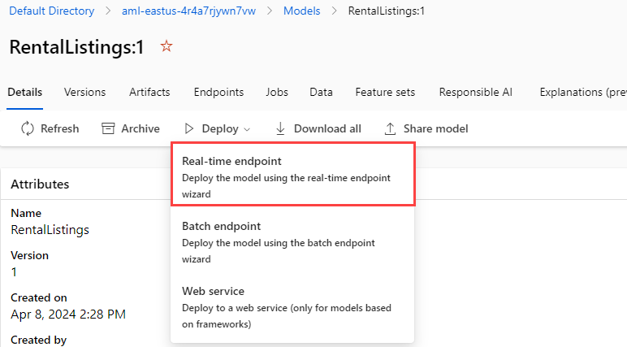

---
lab:
  title: Executar uma inferência usando o Azure Machine Learning
  module: Use Azure Machine Learning Inferencing with Azure Database for PostgreSQL
---

# Executar uma inferência usando o Azure Machine Learning

Como desenvolvedor líder da MT (Margie's Travel), você foi solicitado a ajudar a desenvolver um recurso que estima os preços de aluguel noturno para aluguéis de curto prazo. Você coletou alguns dados históricos como um arquivo de texto e gostaria de usá-los para treinar um modelo de regressão simples no Azure Machine Learning. Em seguida, você gostaria de usar esse modelo em relação aos dados hospedados em um banco de dados de servidor flexível do Banco de Dados do Azure para PostgreSQL.

Neste exercício, você implantará um modelo criado usando a funcionalidade de machine learning automatizado do Azure Machine Learning. Em seguida, você usará esse modelo implantado para estimar os preços de venda noturna para propriedades de aluguel de curto prazo.

## Antes de começar

Você precisa de uma [assinatura do Azure](https://azure.microsoft.com/free) para a qual você tem direitos administrativos.

### Implantar recursos na assinatura do Azure

Esta etapa orientará você no uso de comandos da CLI do Azure do Azure Cloud Shell para criar um grupo de recursos e executar um script Bicep para implantar os serviços do Azure necessários para concluir este exercício em sua assinatura do Azure.

1. Abra um navegador da Web e acesse o [portal do Azure](https://portal.azure.com/).

2. SElecione o ícone do **Cloud Shell** na barra de ferramentas do portal do Azure para abrir um novo painel do [Cloud Shell](https://learn.microsoft.com/azure/cloud-shell/overview) na parte inferior da janela do navegador.

    

    Se solicitado, selecione as opções necessárias para abrir um shell do *Bash*. Se você já usou um console do *PowerShell*, alterne-o para um shell do *Bash*.

3. No prompt do Cloud Shell, insira o seguinte para clonar o repositório GitHub que contém os recursos do exercício:

    ```bash
    git clone https://github.com/MicrosoftLearning/mslearn-postgresql.git
    ```

    Se você já clonou esse repositório GitHub em um módulo anterior, ele ainda estará disponível e você poderá receber a seguinte mensagem de erro:

    ```bash
    fatal: destination path 'mslearn-postgresql' already exists and is not an empty directory.
    ```

    Se você receber essa mensagem, poderá continuar com segurança para a próxima etapa.

4. Em seguida, você executará três comandos para definir variáveis para reduzir a digitação redundante ao usar comandos da CLI do Azure para criar recursos do Azure. As variáveis representam o nome a ser atribuído ao seu grupo de recursos (`RG_NAME`), a região do Azure (`REGION`) na qual os recursos serão implantados e uma senha gerada aleatoriamente para o logon de administrador do PostgreSQL (`ADMIN_PASSWORD`).

    No primeiro comando, a região atribuída à variável correspondente é `eastus`, mas você também pode substituí-la por um local de sua preferência. No entanto, se estiver substituindo o padrão, você deverá selecionar outra [região do Azure que dê suporte ao resumo abstrato](https://learn.microsoft.com/azure/ai-services/language-service/summarization/region-support) para garantir que você possa concluir todas as tarefas nos módulos deste roteiro de aprendizagem.

    ```bash
    REGION=eastus
    ```

    O comando a seguir atribui o nome a ser usado para o grupo de recursos que abrigará todos os recursos usados neste exercício. O nome do grupo de recursos atribuído à variável correspondente é `rg-learn-postgresql-ai-$REGION`, onde `$REGION` é o local especificado acima. No entanto, você pode alterá-lo para qualquer outro nome de grupo de recursos que atenda às suas preferências.

    ```bash
    RG_NAME=rg-learn-postgresql-ai-$REGION
    ```

    O comando final gera aleatoriamente uma senha para o login de administrador do PostgreSQL. Certifique-se de copiá-lo para um local seguro para usar mais tarde para se conectar ao seu servidor flexível do PostgreSQL.

    ```bash
    a=()
    for i in {a..z} {A..Z} {0..9}; 
       do
       a[$RANDOM]=$i
    done
    ADMIN_PASSWORD=$(IFS=; echo "${a[*]::18}")
    echo "Your randomly generated PostgreSQL admin user's password is:"
    echo $ADMIN_PASSWORD
    ```

5. Se você tiver acesso a mais de uma assinatura do Azure e sua assinatura padrão não for aquela na qual você deseja criar o grupo de recursos e outros recursos para este exercício, execute este comando para definir a assinatura apropriada, substituindo o token `<subscriptionName|subscriptionId>` pelo nome ou ID da assinatura que você deseja usar:

    ```azurecli
    az account set --subscription <subscriptionName|subscriptionId>
    ```

6. Execute o seguinte comando da CLI do Azure para criar um grupo de recursos:

    ```azurecli
    az group create --name $RG_NAME --location $REGION
    ```

7. Por fim, use a CLI do Azure para executar um script de implantação do Bicep para provisionar recursos do Azure em seu grupo de recursos:

    ```azurecli
    az deployment group create --resource-group $RG_NAME --template-file "mslearn-postgresql/Allfiles/Labs/Shared/deploy-azure-machine-learning.bicep" --parameters adminLogin=pgAdmin adminLoginPassword=$ADMIN_PASSWORD
    ```

    O script de implantação do Bicep provisiona os serviços do Azure necessários para concluir este exercício em seu grupo de recursos. Os recursos implantados incluem um servidor flexível do Banco de Dados do Azure para PostgreSQL e um workspace do Azure Machine Learning. O script de implantação também criará todos os serviços de pré-requisito para instanciar um workspace do Azure Machine Learning, incluindo uma conta de Armazenamento de Blobs do Azure, um Azure Key Vault, um repositório de contêiner do Azure, um workspace da análise de logs do Azure e uma instância dos insights de aplicativo Azure. O script Bicep também executa algumas etapas de configuração, como adicionar as extensões `azure_ai` e `vector` à _lista de permitidos_ do servidor PostgreSQL (por meio do parâmetro de servidor azure.extensions) e criar um banco de dados nomeado `rentals` no servidor. **Observe que o arquivo Bicep difere dos outros módulos neste roteiro de aprendizagem.**

    A implantação tipicamente leva vários minutos para ser concluída. Você pode monitorá-lo no Cloud Shell ou navegar até a página **Implantações** do grupo de recursos criado acima e observar o progresso da implantação lá.

8. Feche o painel do Cloud Shell quando a implantação do recurso for concluída.

### Solucionar erros de implantação

Você pode encontrar alguns erros ao executar o script de implantação do Bicep.

- Se você executou anteriormente o script de implantação do Bicep para este roteiro de aprendizagem e, posteriormente, excluiu os recursos, poderá receber uma mensagem de erro como a seguinte se estiver tentando executar novamente o script dentro de 48 horas após a exclusão dos recursos:

    ```bash
    {"code": "InvalidTemplateDeployment", "message": "The template deployment 'deploy' is not valid according to the validation procedure. The tracking id is '4e87a33d-a0ac-4aec-88d8-177b04c1d752'. See inner errors for details."}
    
    Inner Errors:
    {"code": "FlagMustBeSetForRestore", "message": "An existing resource with ID '/subscriptions/{subscriptionId}/resourceGroups/rg-learn-postgresql-ai-eastus/providers/Microsoft.CognitiveServices/accounts/{accountName}' has been soft-deleted. To restore the resource, you must specify 'restore' to be 'true' in the property. If you don't want to restore existing resource, please purge it first."}
    ```

    Se você receber essa mensagem, modifique o comando `azure deployment group create` acima para definir o parâmetro `restore` igual a `true` e execute-o novamente.

- Se a região selecionada estiver impedida de provisionar recursos específicos, você deverá definir a variável `REGION` como um local diferente e executar novamente os comandos para criar o grupo de recursos e executar o script de implantação do Bicep.

    ```bash
    {"status":"Failed","error":{"code":"DeploymentFailed","target":"/subscriptions/{subscriptionId}/resourceGroups/{resourceGrouName}/providers/Microsoft.Resources/deployments/{deploymentName}","message":"At least one resource deployment operation failed. Please list deployment operations for details. Please see https://aka.ms/arm-deployment-operations for usage details.","details":[{"code":"ResourceDeploymentFailure","target":"/subscriptions/{subscriptionId}/resourceGroups/{resourceGrouName}/providers/Microsoft.DBforPostgreSQL/flexibleServers/{serverName}","message":"The resource write operation failed to complete successfully, because it reached terminal provisioning state 'Failed'.","details":[{"code":"RegionIsOfferRestricted","message":"Subscriptions are restricted from provisioning in this region. Please choose a different region. For exceptions to this rule please open a support request with Issue type of 'Service and subscription limits'. See https://review.learn.microsoft.com/en-us/azure/postgresql/flexible-server/how-to-request-quota-increase for more details."}]}]}}
    ```

- Se o script não conseguir criar um recurso de IA devido ao requisito de aceitar o contrato de IA responsável, você poderá enfrentar o seguinte erro; nesse caso, use a interface do usuário do Portal do Azure para criar um recurso dos Serviços de IA do Azure e, em seguida, execute novamente o script de implantação.

    ```bash
    {"code": "InvalidTemplateDeployment", "message": "The template deployment 'deploy' is not valid according to the validation procedure. The tracking id is 'f8412edb-6386-4192-a22f-43557a51ea5f'. See inner errors for details."}
     
    Inner Errors:
    {"code": "ResourceKindRequireAcceptTerms", "message": "This subscription cannot create TextAnalytics until you agree to Responsible AI terms for this resource. You can agree to Responsible AI terms by creating a resource through the Azure Portal then trying again. For more detail go to https://go.microsoft.com/fwlink/?linkid=2164190"}
    ```

## Implantar um modelo do Azure Machine Learning

A primeira etapa é implantar um modelo do Azure Machine Learning O repositório contém um exemplo de um modelo treinado em um conjunto de dados de listagem, que você usará em sua integração com o PostgreSQL.

1. Baixe o arquivo `mlflow-model.zip` do [repositório mslearn-postgresql](../../Allfiles/Labs/Shared/mlflow-model.zip). Extraia os arquivos para uma pasta chamada **mlflow-model**.

2. No [portal do Azure](https://portal.azure.com/), navegue até o workspace do Azure Machine Learning.

3. Selecione o botão **Iniciar estúdio** para abrir o Estúdio do Azure Machine Learning.

    

4. Selecione a opção de menu **Workspaces** e escolha o workspace do Azure Machine Learning recém-criado.

    

5. Selecione a opção de menu **Modelos** no menu **Ativos**. Então, selecione a opção de menu **+ Registrar** e selecione **De arquivos locais**.

    

6. No menu **Carregar modelo**, defina o tipo de modelo como **MLflow**. Em seguida, escolha **Procurar** e navegue até a pasta **mlflow-model** e carregue os ativos. Após essa etapa, selecione o botão **Avançar** para continuar.

    

7. Nomeie o modelo **RentalListings** e selecione o botão **Avançar**.

    

8. Selecione o botão **Registrar** para concluir o registro do modelo. Essa ação levará você de volta para a página **Modelos**. Selecione o modelo recém-criado.

    > [!Note]
    >
    > Se você não vir um modelo, selecione o botão de opção de menu **Atualizar** para recarregar a página. Depois disso, você deverá ver o modelo **RentalListings**.

9. Selecione a opção de botão **Implantar** e crie um novo **ponto de extremidade em tempo real**.

    

10. No menu suspenso de implantação, defina a **Máquina virtual** como **Standard_DS2_v2** e a **Contagem de instâncias** como 1. Selecione o botão **Implantar**. A implantação pode levar vários minutos para ser concluída, pois o processo de implantação inclui o provisionamento de uma máquina virtual e a implantação do modelo como um contêiner do Docker.

    

11. Depois que o ponto de extremidade for implantado, navegue até a guia **Consumir** e copie o ponto de extremidade REST e a chave primária para que você possa usá-los na próxima seção.

    

12. Para testar se o ponto de extremidade está sendo executado corretamente, você pode usar a guia **Testar** no ponto de extremidade. Em seguida, cole no bloco a seguir, substituindo qualquer entrada existente no momento. Selecione o botão **Testar** e você verá uma saída JSON contendo uma matriz com um único valor decimal indicando o número de dólares americanos que você deve esperar que essa propriedade específica ganhe por uma única noite de aluguel.

    ```json
    {
        "input_data": {
            "columns": [
                "host_is_superhost",
                "host_has_profile_pic",
                "host_identity_verified",
                "neighbourhood_group_cleansed",
                "zipcode",
                "property_type",
                "room_type",
                "accommodates",
                "bathrooms",
                "bedrooms",
                "beds"
            ],
            "index": [0],
            "data": [["0", "0", "0", "Central Area", "98122", "House", "Entire home/apt", 4, 1.5, 3, 3]]
        }
    }
    ```

    

## Conectar o banco de dados usando o psql no Azure Cloud Shell

Nesta tarefa, você se conectará ao banco de dados `rentals` no servidor flexível do Banco de Dados do Azure para PostgreSQL usando o [utilitário de linha de comando psql](https://www.postgresql.org/docs/current/app-psql.html) do [Azure Cloud Shell](https://learn.microsoft.com/azure/cloud-shell/overview).

1. No [portal do Azure](https://portal.azure.com/), navegue até o servidor flexível do Banco de Dados do Azure para PostgreSQL.

2. No menu de recursos, em **Configurações**, selecione **Bancos de dados** e selecione **Conectar** para o banco de dados`rentals`.

    

3. No prompt "Senha para o usuário pgAdmin" no Cloud Shell, insira a senha gerada aleatoriamente para o logon do **pgAdmin**.

    Uma vez conectado, o prompt `psql` do banco de dados `rentals` é exibido.

4. Durante o restante deste exercício, você continuará trabalhando no Cloud Shell, portanto, pode ser útil expandir o painel na janela do navegador selecionando o botão **Maximizar** no canto superior direito do painel.

    

## Instalar e configurar a extensão `azure_ai`

Antes de usar a extensão `azure_ai`, você deve instalá-la em seu banco de dados e configurá-la para se conectar aos recursos dos Serviços de IA do Azure. A extensão `azure_ai` permite integrar os serviços do OpenAI e Linguagem de IA do Azure ao banco de dados. Para habilitar a extensão em seu banco de dados, siga as etapas abaixo:

1. Execute o seguinte comando no prompt `psql` para verificar se as extensões `azure_ai` e `vector` foram adicionadas com êxito à _ lista de permitidos_ do servidor pelo script de implantação do Bicep que você executou ao configurar o ambiente:

    ```sql
    SHOW azure.extensions;
    ```

    O comando exibe a lista de extensões na _lista de permitidos_ do servidor. Se tudo foi instalado corretamente, sua saída deve incluir `azure_ai` e `vector`, desta maneira:

    ```sql
     azure.extensions 
    ------------------
     azure_ai,vector
    ```

    Antes que uma extensão possa ser instalada e usada no servidor flexível do Banco de Dados do Azure para PostgreSQL, ela deve ser adicionada à _lista de permitidos_ do servidor, conforme descrito em [como usar extensões do PostgreSQL](https://learn.microsoft.com/azure/postgresql/flexible-server/concepts-extensions#how-to-use-postgresql-extensions).

2. Agora, você está pronto para instalar a extensão `azure_ai` usando o comando [CREATE EXTENSION](https://www.postgresql.org/docs/current/sql-createextension.html).

    ```sql
    CREATE EXTENSION IF NOT EXISTS azure_ai;
    ```

    `CREATE EXTENSION` carrega uma nova extensão no banco de dados executando seu arquivo de script. Esse script normalmente cria novos objetos SQL, como funções, tipos de dados e esquemas. Um erro será gerado se já existir uma extensão com o mesmo nome. A adição de `IF NOT EXISTS` permite que o comando seja executado sem gerar um erro se ele já estiver instalado.

3. Em seguida, você deve usar a função `azure_ai.set_setting()` para configurar a conexão com o ponto de extremidade implantado do Azure Machine Learning. Defina as configurações de `azure_ml` para apontar para o ponto de extremidade implantado e sua chave. O valor para `azure_ml.scoring_endpoint` será a URL REST do seu ponto de extremidade. O valor para `azure_ml.endpoint_key` será o valor da Chave 1 ou Chave 2.

    ```sql
    SELECT azure_ai.set_setting('azure_ml.scoring_endpoint','https://<YOUR_ENDPOINT>.<YOUR_REGION>.inference.ml.azure.com/score');
    ```

    ```sql
    SELECT azure_ai.set_setting('azure_ml.endpoint_key', '<YOUR_KEY>');
    ```

## Criar uma tabela contendo listagens para o preço

Você precisará de uma tabela para armazenar as listagens de aluguel de curto prazo que deseja precificar.

1. Execute o seguinte comando no banco de dados `rentals` para criar uma nova tabela `listings_to_price`.

    ```sql
    CREATE TABLE listings_to_price (
        id INT GENERATED BY DEFAULT AS IDENTITY PRIMARY KEY,
        host_is_superhost INT NOT NULL,
        host_has_profile_pic INT NOT NULL,
        host_identity_verified INT NOT NULL,
        neighbourhood_group_cleansed VARCHAR(75) NOT NULL,
        zipcode VARCHAR(5) NOT NULL,
        property_type VARCHAR(30) NOT NULL,
        room_type VARCHAR(30) NOT NULL,
        accommodates INT NOT NULL,
        bathrooms DECIMAL(3,1) NOT NULL,
        bedrooms INT NOT NULL,
        beds INT NOT NULL
    );
    ```

2. Em seguida, execute o comando a seguir no banco de dados `rentals` para inserir novos dados de listagem de aluguel.

    ```sql
    INSERT INTO listings_to_price(host_is_superhost, host_has_profile_pic, host_identity_verified,
        neighbourhood_group_cleansed, zipcode, property_type, room_type,
        accommodates, bathrooms, bedrooms, beds)
    VALUES
        (1, 1, 1, 'Queen Anne', '98119', 'House', 'Private room', 2, 1.0, 1, 1),
        (0, 1, 1, 'University District', '98105', 'Apartment', 'Entire home/apt', 4, 1.5, 2, 2),
        (0, 0, 0, 'Central Area', '98122', 'House', 'Entire home/apt', 4, 1.5, 3, 3),
        (0, 0, 0, 'Downtown', '98101', 'House', 'Entire home/apt', 4, 1.5, 3, 3),
        (0, 0, 0, 'Capitol Hill', '98122', 'House', 'Entire home/apt', 4, 1.5, 3, 3);
    ```

    Esse comando insere cinco linhas de novos dados de listagem.

## Criar uma função para traduzir dados de listagens

Para preencher a tabela de tradução de idioma, você criará um procedimento armazenado para carregar dados em lotes.

1. Execute o seguinte comando no prompt `psql` para criar uma nova função chamada `price_listing`.

    ```sql
    CREATE OR REPLACE FUNCTION price_listing (
        IN host_is_superhost INT, IN host_has_profile_pic INT, IN host_identity_verified INT,
        IN neighbourhood_group_cleansed VARCHAR(75), IN zipcode VARCHAR(5), IN property_type VARCHAR(30),
        IN room_type VARCHAR(30), IN accommodates INT, IN bathrooms DECIMAL(3,1), IN bedrooms INT, IN beds INT)
    RETURNS DECIMAL(6,2)
    AS $$
        SELECT CAST(jsonb_array_elements(inference.inference) AS DECIMAL(6,2)) AS expected_price
        FROM azure_ml.inference(('
        {
            "input_data": {
                "columns": [
                    "host_is_superhost",
                    "host_has_profile_pic",
                    "host_identity_verified",
                    "neighbourhood_group_cleansed",
                    "zipcode",
                    "property_type",
                    "room_type",
                    "accommodates",
                    "bathrooms",
                    "bedrooms",
                    "beds"
                ],
                "index": [0],
                "data": [["' || host_is_superhost || '", "' || host_has_profile_pic || '", "' || host_identity_verified || '", "' ||
                neighbourhood_group_cleansed || '", "' || zipcode || '", "' || property_type || '", "' || room_type || '", ' ||
                accommodates || ', ' || bathrooms || ', ' || bedrooms || ', ' || beds || ']]
            }
        }')::jsonb, deployment_name=>'rentallistings-1');
    $$ LANGUAGE sql;
    ```

    > [!Note]
    >
    > Por padrão, o nome da implantação é uma combinação do nome do modelo (**rentallistings**) e do número de versão (**1**). Se você implantar uma nova versão do modelo e usar o nome de implantação padrão, o novo nome de implantação será **rentallistings-2**.

2. Execute a função utilizando o seguite comando SQL:

    ```sql
    SELECT * FROM price_listing(0, 0, 0, 'Central Area', '98122', 'House', 'Entire home/apt', 4, 1.5, 3, 3);
    ```

    Essa consulta retorna uma estimativa de preço de aluguel por noite em formato decimal.

3. Chame a função para cada linha na tabela `listings_to_price` usando o seguinte comando SQL:

    ```sql
    SELECT l2p.*, expected_price
    FROM listings_to_price l2p
        CROSS JOIN LATERAL price_listing(l2p.host_is_superhost, l2p.host_has_profile_pic, l2p.host_identity_verified,
            l2p.neighbourhood_group_cleansed, l2p.zipcode, l2p.property_type, l2p.room_type,
            l2p.accommodates, l2p.bathrooms, l2p.bedrooms, l2p.beds) expected_price;
    ```

    Essa consulta retorna cinco linhas, uma para cada linha em `listings_to_price`. Ela incluirá todas as colunas da tabela `listings_to_price` e o resultado da função `price_listing()` como `expected_price`.

## Limpar

Depois de concluir este exercício, exclua os recursos do Azure que você criou. Você é cobrado pela capacidade configurada, não por quanto do banco de dados é utilizado. Siga estas instruções para excluir seu grupo de recursos e todos os recursos que você criou para este laboratório.

1. Abra um navegador da Web e navegue até o [portal do Azure](https://portal.azure.com/) e, na home page, selecione **Grupos de recursos** em Serviços do Azure.

    

2. Na caixa de pesquisa de filtro para qualquer campo, insira o nome do grupo de recursos que você criou para este laboratório e selecione o grupo de recursos na lista.

3. Na página **Visão geral** do grupo de recursos, selecione **Excluir grupo de recursos**.

    

4. Na caixa de diálogo de confirmação, insira o nome do seu grupo de recursos que deseja excluir e selecione **Excluir**.
